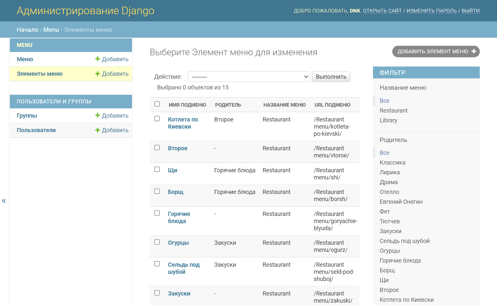
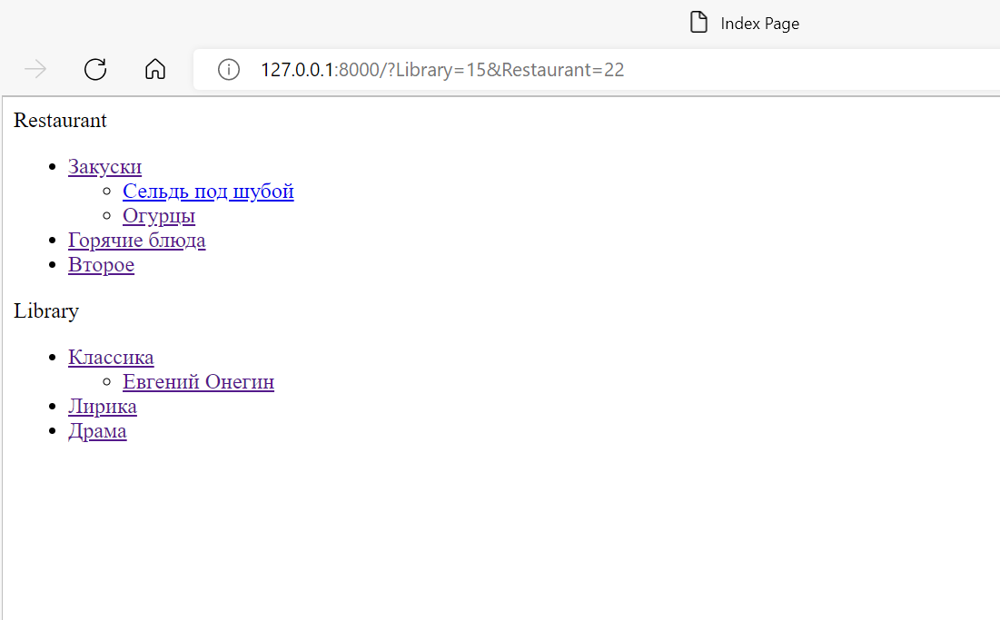

# Menu's viewer
## _Приложение позволяет вносить в базу данных меню (одно или несколько) через админпанель и размещать на любой нужной странице по названию меню._


## Особенности

- позволяет размещать размещать на любой нужной странице по названию меню с помощью тега  , где __main_menu__ - имя меню.

## Описание

1. Меню реализовано через template tag.
2. Все, что над выделенным пунктом - развернуто. Первый уровень вложенности под выделенным пунктом тоже развернут.
3. Хранится в базе данных.
4. Редактируется в стандартной админке Django
5. Активный пункт меню определяется исходя из URL текущей страницы
6. Меню на одной странице может быть несколько. Они определяются по названию.
7. При клике на меню происходит переход по заданному в нем URL. URL может быть задан как явным образом, так и через __named url__.
8. На отрисовку каждого меню требуется ровно один запрос к базе данных.

## Технологии

- [Python 3.7](https://www.python.org/)  - язык программирования, который позволяют быстро работать и более эффективно внедрять системы!
- [Django 2.2.7](https://www.djangoproject.com/)-  упрощает создание лучших веб-приложений быстрее и с меньшим количеством кода.

## Установка

> приводятся команды для `Windows`.

Клонировать репозиторий и перейти в него в командной строке.

```bash
git clone https://github.com/DNKer/inherit_menu.git
```
```bash
cd django_menu
```
Cоздать и активировать виртуальное окружение:
```bash
python -m venv venv
```

```bash
source venv/scripts/activate
```

Обновить систему управления пакетами:

```bash
python -m pip install --upgrade pip
```

Установить зависимости из файла requirements.txt:

```bash
pip install -r requirements.txt
```

Перейти в рабочую директорию:
```bash
cd inherit_menu
```

Выполнить миграции:

```bash
python manage.py makemigrations
```

```bash
python manage.py migrate
```

Запустить проект:

```bash
python manage.py runserver
```

### Шаблон наполнения .env (шаблон-пример есть под именем .env.example) создаем в директории django_menu

```python
SECRET_KEY=django-secret-key
```

### Для работы с меню, которые храняться в базе данных.

Для создания суперпользователя перейти в рабочую директорию:
```bash
cd inherit_menu
```
 и запустите следующую команду:

```bash
 python manage.py createsuperuser
```
Задайте логин, адрес электронной почты и пароль.
Запустите проект и перейдите по адресу:

```http
http://127.0.0.1:8000/admin
```
&#9888;
Сервер работает в отладочном режиме DEBUG = True, для product версии установить False  (статика отображаться не будет).
Согласно документации обработка статики средствами Django очень медленная, небезопасная и допустима к использованию только с dev-сервером в процессе разработки. В рабочем окружении статику должен обслуживать web-сервер.






#### __Лицензия__
###### Free Software, as Is
###### _License Free_
###### Authors: [Dmitry](https://github.com/DNKer)
###### 2023
